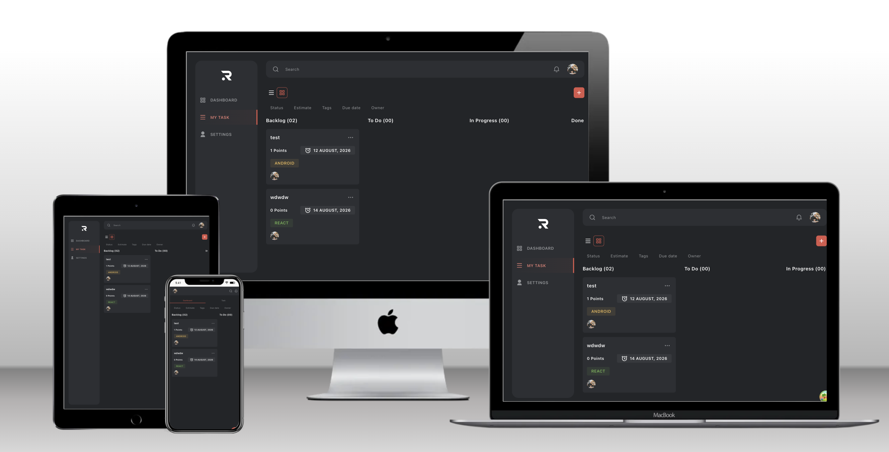

# Task Flow: Task Management App



Task Flow is a complete task management app built on a GraphQL API: browse, create, update, and organize tasks on a kanban-style dashboard.

## Live Demo

The app is deployed on Vercel: **[Task Flow](https://task-flow-iota-lime.vercel.app/)**

## Tech Stack

- **Framework:** React 19 + TypeScript (strict)
- **Build tool:** Vite
- **Routing:** React Router (`createBrowserRouter`)
- **Styling:** Tailwind CSS v4 with design tokens mirroring the Figma design system
- **Data:** TanStack Query + graphql-request, with GraphQL Code Generator for end-to-end typed operations
- **Testing:** Vitest + React Testing Library
- **Linting/Formatting:** ESLint (flat config, typescript-eslint type-checked) + Prettier
- **CI:** GitHub Actions (format check, lint, typecheck, tests, and build on every PR)

## Setup & Running Locally

Requires Node 24.14.1+ (see `.nvmrc`), the first Node 24 release whose bundled npm satisfies the `min-release-age` support floor (the feature landed in npm 11.10.0).

```bash
git clone https://github.com/Alejandroq12/task-flow.git
cd task-flow
npm install
cp .env.example .env.local   # then add the project access token
npm run dev
```

The app runs at `http://localhost:5173`.

### Environment variables

| Variable    | Description                                             |
| ----------- | ------------------------------------------------------- |
| `API_URL`   | GraphQL endpoint of the project API                     |
| `API_TOKEN` | Personal access token (attached server-side, see below) |

Real values live in `.env.local`, which is gitignored. Never commit tokens. `npm run codegen` also requires both variables. `.env.example` ships placeholders for both on purpose: this repo is public and the endpoint is internal to the challenge, so publishing it would help nobody who doesn't already have it from the instructions.

> **Security note:** the token is deliberately not `VITE_`-prefixed. Vite inlines `VITE_*` variables into the public JS bundle, where anyone could extract them. Instead, the app calls the relative path `/graphql`, and the dev server proxies it to the real API, attaching the `Authorization` header in Node (see `vite.config.ts`). The token never reaches the browser. A deployed build would need the same proxy as a serverless function; the static bundle alone cannot, and must not, carry the token. That proxy would itself need caller authentication and rate limiting, since an open proxy holding a shared token is effectively an open relay to the API. `API_URL` must be `https` (enforced at startup); the token never travels over plaintext.

### Deploying (Vercel)

The static bundle holds no API URL or token, so the deployment carries its own Node-side proxy. `api/graphql.ts` is a Vercel serverless function that forwards `POST /api/graphql` to the real API with the Bearer header attached server-side. `vercel.json` rewrites `/graphql` to it (so the client code is identical in every environment) and falls back to `index.html` for client-side routes. Setup: add `API_URL` and `API_TOKEN` (same names as `.env.local`) under Project → Settings → Environment Variables, then redeploy. **Accepted risk for this challenge:** the function has no caller authentication or rate limiting, so the deployed URL is an open relay to the challenge API (see the security note above). That's acceptable for a graded demo holding a scoped challenge token, not for production.

### Available scripts

```bash
npm run dev           # start dev server
npm run build         # typecheck + production build
npm run lint          # run ESLint
npm run typecheck     # run tsc -b (project references)
npm test              # run unit tests once (vitest)
npm run test:watch    # run tests in watch mode
npm run format        # format with Prettier
npm run format:check  # verify formatting (used in CI)
npm run codegen       # generate typed GraphQL operations from the API schema
npm run preview       # preview production build locally
```

## Project Structure

```text
src/
  app/          # App shell: router, route-level pages (NotFound, RouteError) + tests
  components/
    layout/     # Structural components (Layout with sidebar/header slots)
    ui/         # Shared, reusable UI components (used by 2+ features)
  features/     # Feature modules: components/hooks/types owned by one feature
    tasks/      #   dashboard, task cards, task mutations
    settings/   #   user profile page
  graphql/
    generated/  # created by `npm run codegen` (do not edit by hand)
  lib/          # cross-cutting setup (GraphQL client, TanStack QueryClient)
  test/         # test setup (jest-dom matchers)
```

## Rationale & Decisions

**Why this folder structure?**

Feature-based instead of type-based. Everything a feature owns (components, hooks, types) lives in its own folder, so `features/tasks` could keep growing with cards, modals, menus, the date picker, and filters without me hunting through a global `components/` pile. Promotion to `components/ui` follows one rule: a piece moves there when a second feature actually needs it, not before. And features never import from each other, so the only inbound edges are the router and its tests: deleting a feature means removing its folder plus its route entry, and nothing else in the app would notice. The payoff is a boring dependency graph, which is exactly what I want in a codebase.

**Why this styling solution?**

Tailwind CSS v4 with `@theme` tokens named after the Figma color styles. The important decision is not Tailwind itself but what I removed: I cleared the stock color, text, shadow, and tracking namespaces, so a class like `text-red-500` doesn't exist in this project. In those namespaces, the only utilities that compile are the ones generated from the design system tokens (layout utilities like `flex` and `p-4` stay stock, and arbitrary values like `bg-[#fff]` could still slip through, which is why they're treated as review findings). That makes the visual side of design fidelity mostly build-enforced instead of something a reviewer has to catch, and it keeps the Figma-to-code mapping literal: the mockup says Neutral 4, the class says `bg-neutral-4`.

**Why this data-fetching approach?**

TanStack Query + graphql-request + GraphQL Code Generator. Apollo was the obvious candidate and I looked at it first, but its centerpiece is a normalized cache, and this app doesn't have the problem that solves: there's one main query and a handful of mutations. What I actually needed was server-state management, meaning caching, loading and error states, retries, and cache invalidation after a mutation. That's exactly TanStack Query's job, and it does it with far less API surface. Underneath it, graphql-request is a small typed fetcher, and codegen generates TypeScript types straight from the API schema, so a query result is typed end to end without hand-written interfaces that could drift from reality. The tradeoff I accepted: no normalized cache means updates work by invalidate-and-refetch rather than surgical cache writes. That costs an extra round trip after each mutation, and it still depends on invalidating the right query keys. But with one main query there's only one key family to get right, and the server stays the single source of truth instead of a hand-maintained cache that can drift from it.

**What I'd do differently with more time:**

Drag and drop between columns is the feature I most wanted to reach. The groundwork is already in place: the API's `position` field is a `Float` precisely so a card can drop between two others without renumbering the whole column, and the create/update flows already send it. But doing drag and drop accessibly (keyboard support, screen reader announcements) deserves more than a rushed afternoon. I'd also add optimistic updates: today every mutation invalidates and refetches, which keeps the UI honest with the server but feels one round-trip slower than it could. And I'd grow the test suite. Near the deadline I made a deliberate call: no new tests, keep the existing suite green in CI, and verify every new feature in a real browser instead. I still think that was the right trade under the clock, but the coverage debt is real and I'd pay it down first.

## What's Implemented

- [x] Initial setup (folder structure, routing, styles solution, linting/formatting, error boundary, tests, CI)
- [x] Dashboard UI (static): sidebar with mobile drawer, header, toolbar, five status columns, task cards
- [x] API connection: fetch tasks into their status columns, with loading skeleton, failure alert + retry, and empty state
- [x] Create task: the + buttons open a Figma-matched modal (full-screen page on mobile, floating panel on desktop) with custom estimate/assignee/tag menus and per-breakpoint date pickers; createTask + cache invalidation + error handling
- [x] Update task: Edit via the card/list options menu, reusing the shared TaskForm with all six required editable fields (name, due date, position, status, tags, estimate) plus assignee; success/failure notifications
- [x] Delete task: 'Delete Task?' confirmation via the options menu, deleteTask by id, success/failure notifications
- [x] View toggle & My Task: grid/list layouts on both views (list = the mockup's grouped table with due-date row indicators), switched by the toolbar icons on desktop and by the Dashboard/Task tabs on mobile; My Task filters to tasks assigned to the logged-in user via the profile query
- [x] Search & filter: the header search and five filter chips (status, estimate, tags, due date, owner) live in URL search params, combine freely, and show a dedicated empty-results state when nothing matches
- [x] User settings page: reached from a Settings sidebar item (same NavLink anatomy as Dashboard and My Task; the design system documents its SidebarItem as an abstract component, which sanctions adding a third item) and by clicking the header avatar; /settings renders the profile query (full name, email, type chip, created/updated dates) in an invented card design built from the app's own tokens; the requirement's Position field does not exist on the API's User type (verified by introspection), so the row says so instead of fabricating a value

## Bonus Points

- **Total count of tasks by column:** board column headers and list group headers both carry live counts.
- **Layout toggle (columns ↔ list):** the desktop icon switcher and the mobile Dashboard/Task tabs drive one shared selection that survives navigation and resizes.
- **Due-date colors:** green on time, amber under two days, red overdue. One rule (`dueInfo` in `task-display.ts`) drives the card date chips, the list view's row indicators, and the list date text. The mockup only shows the red/neutral chip states; the requirement asks for three colors, and requirements outrank mockups.
- **Add-task animation:** after a create, the board refetches, scrolls the new card into view, and the card fade-rises in. React reconciles by task id, so only the genuinely new card mounts and animates, never the whole board. Under reduced-motion preferences, the scroll is instant and the entrance animation is disabled.

## Additional Notes

- **Generated GraphQL code is committed on purpose.** `src/graphql/generated/` (output of `npm run codegen`) is checked into git so CI can typecheck and build without holding the API token. Regenerate after changing any query/mutation; never edit by hand.
- **Quality gates are CI-enforced, not hook-enforced.** The repo deliberately has no git hooks (husky/lint-staged): CI runs format check, lint, typecheck, tests, and build on every PR, and the same scripts run locally on demand. Hooks can be added later if commit-time enforcement proves necessary.
- **The settings Position row says "Not provided by the API."** The requirement lists Position among the user fields, but the User type has no such field (introspection: fullName, email, type, avatar, createdAt, updatedAt). The row still renders so the requirement's shape is visible, with an honest value instead of an invented one.
- **Filter state lives in the URL.** Search and filters are `?q=…&status=…` search params, not component state: filtered views are shareable/bookmarkable and survive reloads, and search-params changes don't remount the page (the error boundary keys on pathname only). Three observed API behaviors are documented rather than papered over: name matching is a **case-sensitive** substring (verified: `icket` matches `Ticket5`, `ticket` does not); `dueDate` filters by **exact timestamp** equality (this app writes all due dates at noon UTC, so day-level filtering works for tasks it created); and `ownerId` is accepted but **ignored by the server** (a nonexistent id returns the full task list). The param is still sent as required, and the owner filter also applies client-side against the task's `creator.id`, so the control does what it says.
- **Tag labels derive from the API enum.** The mockups show sample tag texts that contradict each other across surfaces (the same tag renders "IOS APP" on cards but "IOS" in the tag menu, "ANDROID" on cards but "Android App" in the menu). Since the API's TaskTag enum is the real domain, labels derive from the enum values (IOS, ANDROID, REACT, NODE JS, RAILS) and are identical everywhere.
- **List group-header hover icons are omitted.** One mockup group header shows +/… icons; they have no behavior behind them (non-working UI, same principle as the bell).
- **List rows have an actions column the mockup lacks.** The requirement ties update/delete to the options icon, and a list-only user would otherwise have no way to reach them. The requirement wins over the drawing, so each row ends with the same options menu the cards use.
- **List-view row borders follow the due date.** The mockup's task table shows rows with identical dates but different left-border colors, an inconsistency the team acknowledged in Slack ("we use to have those in real projects"). Per the team's guidance that the border is a due-date indicator, the rule is: overdue = red (primary), due within two days = amber (tertiary), later = green (secondary).
- **The header bell is THE notification system.** Mutation successes and failures are recorded to a notification center the bell opens (unread dot, ten-entry history, marked read on open); failures also surface as inline alerts in the dialog that caused them, so errors are impossible to miss. Transient toasts were built first and deliberately removed. Two presentations of the same event stream duplicated a function; the bell is the one the Figma shows. The panel's own design has no mockup, so it reuses the app's menu anatomy. The card metric icons below stay omitted because their data provably does not exist in the schema; the bell's does.
- **Card attachment/fork/comment icons are omitted.** The Figma shows those metrics on task cards, but the API's Task type exposes no fields for them. Per mentor guidance not to expose non-working UI, the icons are removed until the schema provides the data; the SVGs live in git history for easy reintroduction.
- **Node 24 is a hard requirement.** `.npmrc` sets `engine-strict=true`, so `npm install` fails fast on older Node instead of warning.
- **A11y deviation from the design, flagged and recommended per mentor guidance:** the Figma's active-tab red (`primary-4`, `#da584b`) on the dark surface measures ≈3.5:1, below WCAG AA's 4.5:1 for 15px text. Following the design team's process (flag + recommend), the active label uses `primary-3` (`#e27d73`), one step up the design system's own red scale, which measures ≈4.7:1 (≈4.5:1 worst-case over the 5% gradient wash). The indicator bar stays `primary-4` (non-text graphic, 3:1 rule, passes). The active state is also conveyed non-visually via `aria-current="page"`.
